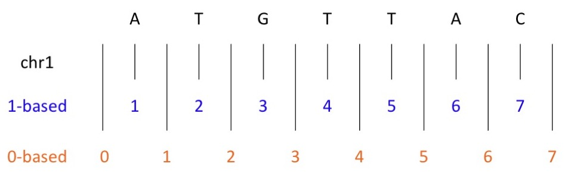

```{r setup, include=FALSE}
knitr::opts_chunk$set(echo = TRUE)
```
<style>
h2 { 
 color: black;		
}
h3 { 
 color: black;		
}
</style>


## Discussion points:

* Overview of Ribo-seq analysis workflows
* File types
* Data needed

# Workflow overview

## Workflow

Raw data -> Quality check -> Adapter Removal -> Quality filter -> Contaminant removal -> Alignment -> Read length selection -> Translation analysis

## Quality check

Input fastq, output fastq and quality check results

## Adapter Removal 

Input fastq and adaptor sequence, output fastq

## Quality filter 

Input fastq, output fastq

## Contaminant removal 

Input fastq and fasta, output fastq

Data here - need rRNA and tRNA
Where from?
FASTA files.

## Alignment 

Input fastq, output SAM
SAM to BAM
aligned/sorted bam

## Read length selection 

## Translation analysis

# File types

## FASTA

* DNA, RNA, and protein sequences are stored in FASTA format.
* This could be a single transcript, or an entire genome.
* FASTA files generally have the extension .fa or .fasta (eg file1.fa).
* Multiple sequence alignments are also stored in FASTA format, with dashes (-) used to indicate gaps in the alignment.

Example:
```{bash, eval = FALSE}
>ENST00000607096.1|ENSG00000284332.1|-|-|MIR1302-2-201|MIR1302-2|138|miRNA|
GGATGCCCAGCTAGTTTGAATTTTAGATAAACAACGAATAATTTCGTAGCATAAATATGT
CCCAAGCTTAGTTTGGGACATACTTATGCTAAAAAACATTATTGGTTGTTTATCTGAGAT
TCAGAATTAAGCATTTTA
```

The Sequence ID must be unique, and not contain spaces.

## FASTA files in Ribo-seq

Highlight - contaminent removal, alignment

*Drosophila melanogaster* rRNA:

```{bash, eval = FALSE}
>gi|174298|gb|M25016.1|DRORR5SEM D.melanogaster 5S rRNA
GCCAACGACCATACCACGCTGAATACATCGGTTCTCGTCCGATCACCGAAATTAAGCAGCGTCGCGGGCG
GTTAGTACTTAGATGGGGGACCGCTTGGGAACACCGCGTGTTGTTGGCCT
```

## FASTQ

* FASTQ files contain sequencing data, and corresponding quality scores.
* RNA-seq and ribo-seq files will be in FASTQ format.
* Encoding used for quality scores can vary.

## FASTQ

Each sequence in a FASTQ file contains 4 lines:
```{bash, eval = FALSE}
LINE 1: @Sequence_ID:optional description of sequencing run
LINE 2: Raw sequence letters (A,C,T,G,N)
LINE 3: + (a separator)
LINE 4: Quality scores of sequence
```

Example:
```{bash, eval = FALSE}
@NB501623:178:HJLC2BGX5:1:11101:5397:1056 1:N:0:AGTCAA
CGGTCNGTGAAGAGTCGAACGTGCTCTGCNGNAGATCGGAAGAGCACACNTCTGANCTCNAGTCACANTNANATNT
+
AAAAA#EEEEEEEEE<E/EEEEEEEE/EE#/#EE/EEEE/EE<AE/EEE#EEAE/#EAE#EEAE/EA#E#E#EE#/
```

## FASTQ files in Ribo-seq

Highlight - raw data util alignments.

## fai

* fai files are indexes for an accompanying fasta or fastq file.
* These allow efficient access to regions within sequences.
* fai files contain five tab-delimited columns for FASTA, and six for FASTQ

```{bash, eval = FALSE}
NAME  LENGTH  OFFSET  LINEBASES  LINEWIDTH   QUALOFFSET
```

## fai 

```{bash, eval = FALSE}
NAME  LENGTH  OFFSET  LINEBASES  LINEWIDTH   QUALOFFSET
```

Where:

* <b>NAME</b> - sequence name
* <b>LENGTH</b> -	length of the reference sequence, in bases
* <b>OFFSET</b> -	Offset from the first base of the sequence
* <b>LINEBASES</b>	- The number of bases on each line of the sequence
* <b>LINEWIDTH</b>	- The number of bytes in each line, including the newline
* <b>QUALOFFSET</b> -	Offset of sequence's first quality score

## fai 

```{bash, eval = FALSE}
NAME  LENGTH  OFFSET  LINEBASES  LINEWIDTH   QUALOFFSET
```

Example: GRCh38.primary_assembly.genome.fa.fai

```{bash, eval = FALSE}
chr1	248956422	8	60	61
chr2	242193529	253105712	60	61
chr3	198295559	499335808	60	61
```

## GFF3

* General Feature Format (GFF) files are used to describe features of sequences.
* GFF3 is now the standard - GFF2 is depreciated.
* GFF3 files contain 9 tab-delimited columns.
* Gene Transfer Format (GTF) files are similar to GFF3 

```{bash, eval = FALSE}
seqid   source   type   start   end   score   strand   phase   attributes
```

## GFF3

```{bash, eval = FALSE}
seqid   source   type   start   end   score   strand   phase   attributes
```

Where:

* <b>seqid</b> - the name of the sequence containing the feature
* <b>source</b>  - source of the feature (a program or project)
* <b>type</b>   - feature type (CDS, gene, exon)
* <b>start</b>  - start position (1-base offset)
* <b>end</b>  - end position (1-base offset)
* <b>score</b> - varies
* <b>strand</b>  - +, -, ?, or .
* <b>phase</b> - 0,1,2, or . - where the first codon starts
* <b>attributes</b> - extra information.

<div class="notes">
E-values for sequence similarity features,
P-values for ab initio gene prediction features.
The phase is one of the integers 0, 1, or 2, indicating the number of bases forward from the start of the current CDS feature the next codon begins. 
</div>

## GFF3

```{bash, eval = FALSE}
seqid   source   type   start   end   score   strand   phase   attributes
```

Example:

```{bash, eval = FALSE}
##gff-version 3.1.26
##sequence-region ctg123 1 1497228
ctg123 . gene            1000  9000  .  +  .  ID=gene00001;Name=EDEN
ctg123 . TF_binding_site 1000  1012  .  +  .  ID=tfbs00001;Parent=gene00001
ctg123 . mRNA            1050  9000  .  +  .  ID=mRNA00001;Parent=gene00001;Name=EDEN.1
```

The first line is a comment that defines the version.

### GFF3/GTF files in ribo-seq

alignment


## Coordinate systems

* Files are often 1-based or 0-based.
* 1-based - numbers nucleotides directly.
* 0-based - numbers between nucleotides.



## Coordinate systems


    Seq       1-based     0-based      
----------  ----------  ----------
   ATG        chr1:1-3   chr1:0-3 	
   C          chr1:7-7 	 chr1:6-7 

## Coordinate systems

### 1-based
* GFF
* SAM

### 0-based
* BED
* BAM


## SAM

* Sequence Alignment Map (SAM) files contain sequence reads, and alignment data that links them to a reference sequence.
* Used for visualing sequences in genome browsers.

## SAM files in ribo-seq

contaminant removal - aligned rRNA/tRNA reads, alignment output

```{bash, eval = FALSE}
@HD	VN:1.0	SO:unsorted
@SQ	SN:gi|158246|gb|M21017.1|DRORGAB	LN:12026
@SQ	SN:gi|174298|gb|M25016.1|DRORR5SEM	LN:120
@PG	ID:bowtie2	PN:bowtie2	VN:	CL:"bowtie2-align-s --wrapper basic-0 --threads 6 --trim3 1 -k 1 -x bowtie_indexes/rRNA_fly --passthrough -U Quality_filter_outputs/SRR1548656.qualfilt_output.fastq"
SRR1548656.34	4	*	0	0	*	*	0	0	TCCCATATTGTCTAGTGGTTAGGATATCCGGC	CCCFFFFFHHHHHJJGIIJJIJJJJIJJJJJJ	YT:Z:UU
SRR1548656.35	0	gi|158246|gb|M21017.1|DRORGAB	5188	255	38M	*	0	0	ATGGGCCTCGTGCTCATCCTGGCAACAGGAACGACCAT	BCCFFFFFGHHHHJJJJJJJJJIGIJJJJIGCHIJJJJ	AS:i:0	XN:i:0	XM:i:0	XO:i:0	XG:i:0	NM:i:0	MD:Z:38	YT:Z:UU
SRR1548656.36	0	gi|158246|gb|M21017.1|DRORGAB	2873	255	29M	*	0	0	TGCTTNGACTACATATGGTTGAGGGTTGT	CCCFF#2AFHHHHJJIJJJJJIJJJHIJJ	AS:i:-1	XN:i:0	XM:i:1	XO:i:0	XG:i:0	NM:i:1	MD:Z:5G23	YT:Z:UU
SRR1548656.37	0	gi|158246|gb|M21017.1|DRORGAB	839	255	34M	*	0	0	ATTAGNGTGCTTAAAGCAGGCTTCAAATGCCTGA	CCCFF#2=DHHHHJJJJJJJJJJJJJJJJJJJJI	AS:i:-1	XN:i:0	XM:i:1	XO:i:0	XG:i:0	NM:i:1	MD:Z:5A28	YT:Z:UU
SRR1548656.38	0	gi|158246|gb|M21017.1|DRORGAB	1682	255	33M	*	0	0	ATTTCNTAGACCGAGAGGTCCGGGTAAACCGCT	CCCFF#4ACFHHHJJJJJJJJJJJHFHIHFHIJ	AS:i:-1	XN:i:0	XM:i:1	XO:i:0	XG:i:0	NM:i:1	MD:Z:5C27	YT:Z:UU
SRR1548656.39	0	gi|158246|gb|M21017.1|DRORGAB	2723	255	30M	*	0	0	ACTCTAAGCGGTGGATCACTCGGCTCATGG	CCCFFFFFGHHHHJIJJJJJJJJJJJJJJJ	AS:i:0	XN:i:0	XM:i:0	XO:i:0	XG:i:0	NM:i:0	MD:Z:30	YT:Z:UU
```


## BAM

* BAM files are binary versions of SAM files.
* Not human readable, but much smaller files.
* .bai - index as in .fai

## BAM in ribo-seq

alignments
probably get sam out, change to bam 

## BED

* BED files allow users to define how annotation tracks are displayed
* Upto 12 tab-delimited columns, only the first 3 are required.

IMAGE OF DATA TRACK FROM GENOME BROSWER

```{bash, eval = FALSE}
chrom chromStart chromEnd name strand thickStart thickEnd itemRgb blockCount 
blockSizes blockStarts
```

## BED

Required fields:

* <b>chrom</b> - Name of the chromosome or scaffold
* <b>chromStart</b> - Start position of chromosome (0-based)
* <b>chromEnd</b> - End postition of chromosome

## BED

Optional fields

* <b>name</b> - Name of the line
* <b>score</b> - between 0-1000, determines grayness of track
* <b>strand</b> - + or - 
* <b>thickStart</b> - start position of thick blocks (start codon)
* <b>thickEnd</b> - end position of thick blocks
* <b>itemRgb</b> - colour of the data in the line
* <b>blockCount</b> - number of exons (blocks) in the line
* <b>blockSizes</b> - comma-separated list of block sizes
* <b>blockStarts</b> - comma-separated list of block starts relative to chromStart

### BED files in ribo-seq

translation analysis

## Generic file types

* Log files 
    * Program and version
    * Command used
    * Job start and end time
    * Results
    * Errors

## Thanks!
### Any questions?


# Extras

## Compressing files

* .zip - a compressed archive of file(s).
* .gz - a compressed file(s).
* .tar - an archive of files(s).

<div class="notes">
Archiving - storing multiple files as one file - for easier transfer. 
tar/tarball
</div>

## Compressing files

```{bash, eval = FALSE}
#Create a tarball
tar -czvf filename.tar.gz /path/to/dir

#Extract a tarball
tar -xzvf filename.tar.gz
```

Where:

* -c = create new archive
* -x = extract files from an archive
* -z = use gzip
* -v = verbose
* -f = use archive file

## Asking for help

### Online forums:

* Biostars
* stackoverflow

### Communities:

* R-ladies
* The Turing Way

## md5sum

* You may be asked for the md5sum or MD5 hash to verify file transfers.
* This is a code that acts as a fingerprint for a file - if the file changes, the code will change.

Example on mac:

```{bash, eval=FALSE}
MD5 (TLUK2021_talk.Rmd) = 01b9630ca402b38d9d50567fa783f92d
```


