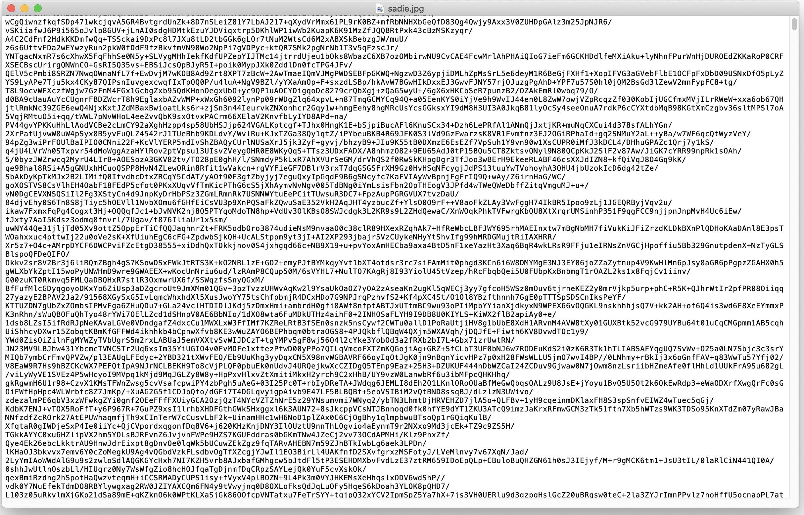
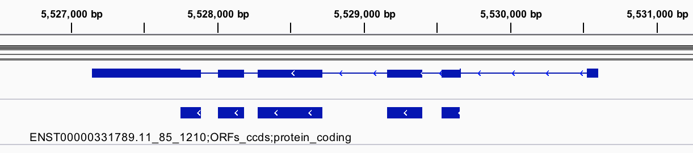

```{r setup, include=FALSE}
knitr::opts_chunk$set(echo = TRUE)
library(DiagrammeR)
```

<style>
h2 { 
 color: black;		
}
h3 { 
 color: black;		
}
figcaption {
    margin-bottom: 5px;
    font-size: 60%;
}
p.caption {
  font-size: 0.6em;
  margin-top: 5px;
}
</style>

# File formats

## Text files 

<div style="float: left; width: 30%;">
  * Plain text - a file containing only text.
  * Rich text - a file which includes text formatting (e.g. bold text).
</div>  
  
<div style="float: right; width: 65%;">

 
 <figcaption>Plain text file in the terminal.</figcaption>

</div> 

## Text files 

<div style="float: left; width: 30%;">
  * Plain text - a file containing only text.
  * Rich text - a file which includes text formatting (e.g. bold text)
</div>  
  
<div style="float: right; width: 65%;">

 
 <figcaption>Plain text file viewed in text edit. </figcaption>


</div> 


## File formats

Binary files:

<div style="float: left; width: 30%;">

 
 <figcaption>Sadie!</figcaption>

</div>  
  
<div style="float: right; width: 70%;">

 
 <figcaption>Binary file (Sadie.jpg) viewed in text edit. </figcaption>


</div> 

# Workflow Overview

## Overview

```{r,echo=FALSE, fig.width=3.5,fig.alt="A flow chart for a general ribo-seq analysis workflow. The flow is as follows: Raw data - Adapter Removal - Quality Check - Contaminant removal - Quality Filter Alignment - Assess Ribosome Profiling Quality - Translation analysis."}

grViz("digraph flowchart {
      node [fontname = Helvetica, shape = rectangle, fontsize=18]        
      tab1 [label = 'Raw data', shape = folder]
      tab2 [label = 'Adapter Removal']
      tab3 [label = 'Quality Check']
      tab4 [label = 'Contaminant removal']
      tab5 [label = 'Quality Filter']
      tab6 [label = 'Alignment']
      tab7 [label = 'Assess Ribosome \nProfiling Quality']
      tab8 [label = 'Translation analysis']

      # edge definitions with the node IDs
      tab1 -> tab2 -> tab3 -> tab4 -> tab5 -> tab6 -> tab7 -> tab8;
      }
      ")

```

# File types

## FASTA

* DNA, RNA, and protein sequences are stored in FASTA format.
* This could be a single transcript, or an entire genome.
* FASTA files generally have the extension .fa or .fasta (eg file1.fa).
* Multiple sequence alignments are also stored in FASTA format, with dashes (-) used to indicate gaps in the alignment.

Example:
```{bash, eval = FALSE}
>ENST00000607096.1|ENSG00000284332.1|-|-|MIR1302-2-201|MIR1302-2|138|miRNA|
GGATGCCCAGCTAGTTTGAATTTTAGATAAACAACGAATAATTTCGTAGCATAAATATGT
CCCAAGCTTAGTTTGGGACATACTTATGCTAAAAAACATTATTGGTTGTTTATCTGAGAT
TCAGAATTAAGCATTTTA
```

The Sequence ID must be unique, and should not contain spaces.

## FASTA files in Ribo-seq

<div style="float: right; width: 25%;">
```{r,echo=FALSE, fig.width=3.5, fig.alt="A flow chart for a general ribo-seq analysis workflow. The flow is as follows: Raw data - Adapter Removal - Quality Check - Contaminant removal - Quality Filter Alignment - Assess Ribosome Profiling Quality - Translation analysis."}

grViz("digraph flowchart {
      node [fontname = Helvetica, shape = rectangle, fontsize=18]        
      tab1 [label = 'Raw data', shape = folder]
      tab2 [label = 'Quality Check']
      tab3 [label = 'Adapter Removal']
      tab4 [label = 'Contaminant removal']
      tab5 [label = 'Quality Filter']
      tab6 [label = 'Alignment']
      tab7 [label = 'Read length selection']
      tab8 [label = 'Translation analysis']

      # edge definitions with the node IDs
      tab1 -> tab2 -> tab3 -> tab4 -> tab5 -> tab6 -> tab7 -> tab8;
      }
      ")

```
</div>

## FASTA files in Ribo-seq

<div style="float: left; width: 75%;">

*Drosophila melanogaster* rRNA:

```{bash, eval = FALSE}
>gi|174298|gb|M25016.1|DRORR5SEM_D.melanogaster_5S_rRNA
GCCAACGACCATACCACGCTGAATACATCGGTTCTCGTCCGATCACCGAAATTAAGC
AGCGTCGCGGGCGGTTAGTACTTAGATGGGGGACCGCTTGGGAACACCGCGTGTTGT
TGGCCT
```

</div>

<div style="float: right; width: 25%;">
```{r,echo=FALSE, fig.width=3.5,fig.alt="A flow chart for a general ribo-seq analysis workflow. The flow is as follows: Raw data - Adapter Removal - Quality Check - Contaminant removal - Quality Filter Alignment - Assess Ribosome Profiling Quality - Translation analysis. The contaminant removal and alignment steps are highlighted to show that they require FASTA files."}


grViz("digraph flowchart {
      node [fontname = Helvetica, shape = rectangle, fontsize=18]        
      tab1 [label = 'Raw data', shape = folder]
      tab2 [label = 'Quality Check']
      tab3 [label = 'Adapter Removal']
      tab4 [label = 'Contaminant removal', color=Pink, style=filled]
      tab5 [label = 'Quality Filter']
      tab6 [label = 'Alignment', color=Pink, style=filled]
      tab7 [label = 'Read length selection']
      tab8 [label = 'Translation analysis']

      # edge definitions with the node IDs
      tab1 -> tab2 -> tab3 -> tab4 -> tab5 -> tab6 -> tab7 -> tab8;
      }
      ")

```
</div>

<font size ="3">[@fasta]</font>

## FASTQ

* FASTQ files contain sequencing data, and corresponding quality scores.
* Phred score/Q score - measures the probability a base is called incorrectly.
    * <b>Q-score</b>: Q = -10log~10~(e)
    * where e is the estimated probablitiy of the base call being wrong
    * Q = 20 - error rate 1 in 100.
    * Q = 30 - eror rate 1 in 1000.
* Quality scores are encoded, using ASCII characters to represent numerical scores.

<font size ="3">[@NGS;@fastq]</font>


## FASTQ

Each sequence in a FASTQ file contains 4 lines:
```{bash, eval = FALSE}
LINE 1: @Sequence_ID:optional description of sequencing run
LINE 2: Raw sequence letters (A,C,T,G,N)
LINE 3: + (a separator)
LINE 4: Quality scores of sequence
```

Example:
```{bash, eval = FALSE}
@NB501623:178:HJLC2BGX5:1:11101:5397:1056 1:N:0:AGTCAA
CGGTCNGTGAAGAGTCGAACGTGCTCTGCNGNAGATCGGAAGAGCACACNTCTGANCTCNAGTCACANTNANATNT
+
AAAAA#EEEEEEEEE<E/EEEEEEEE/EE#/#EE/EEEE/EE<AE/EEE#EEAE/#EAE#EEAE/EA#E#E#EE#/
```

A = 32, E = 36, # = 35, < = 27

## FASTQ files in Ribo-seq

<div style="float: right; width: 25%;">
```{r,echo=FALSE, fig.width=3.5,fig.alt="A flow chart for a general ribo-seq analysis workflow. The flow is as follows: Raw data - Adapter Removal - Quality Check - Contaminant removal - Quality Filter Alignment - Assess Ribosome Profiling Quality - Translation analysis."}

grViz("digraph flowchart {
      node [fontname = Helvetica, shape = rectangle, fontsize=18]        
      tab1 [label = 'Raw data', shape = folder]
      tab2 [label = 'Quality Check']
      tab3 [label = 'Adapter Removal']
      tab4 [label = 'Contaminant removal']
      tab5 [label = 'Quality Filter']
      tab6 [label = 'Alignment']
      tab7 [label = 'Read length selection']
      tab8 [label = 'Translation analysis']

      # edge definitions with the node IDs
      tab1 -> tab2 -> tab3 -> tab4 -> tab5 -> tab6 -> tab7 -> tab8;
      }
      ")

```
</div>

## FASTQ files in Ribo-seq

<div style="float: left; width: 75%;">
* Single-end seq - one fastq per sample (R1).
* Paired-end seq - two fastqs per sample (R1 and R2).
</div>

<div style="float: right; width: 25%;">
```{r,echo=FALSE, fig.width=3.5,fig.alt="A flow chart for a general ribo-seq analysis workflow. The flow is as follows: Raw data - Adapter Removal - Quality Check - Contaminant removal - Quality Filter Alignment - Assess Ribosome Profiling Quality - Translation analysis. The all steps from Raw data to alignment are highlighted to show that they require FASTQ files."}

grViz("digraph flowchart {
      node [fontname = Helvetica, shape = rectangle, fontsize=18]        
      tab1 [label = 'Raw data', shape = folder, color=Pink, style=filled]
      tab2 [label = 'Quality Check', color=Pink, style=filled]
      tab3 [label = 'Adapter Removal', color=Pink, style=filled]
      tab4 [label = 'Contaminant removal', color=Pink, style=filled]
      tab5 [label = 'Quality Filter', color=Pink, style=filled]
      tab6 [label = 'Alignment', color=Pink, style=filled]
      tab7 [label = 'Read length selection']
      tab8 [label = 'Translation analysis']

      # edge definitions with the node IDs
      tab1 -> tab2 -> tab3 -> tab4 -> tab5 -> tab6 -> tab7 -> tab8;
      }
      ")

```
</div>

## fai

* fai files are indexes for an accompanying fasta or fastq file.
* These allow efficient access to regions within sequences.
* fai files contain five tab-delimited columns for FASTA, and six for FASTQ

```{bash, eval = FALSE}
NAME  LENGTH  OFFSET  LINEBASES  LINEWIDTH   QUALOFFSET
```

## fai 

```{bash, eval = FALSE}
NAME  LENGTH  OFFSET  LINEBASES  LINEWIDTH   QUALOFFSET
```

Where:

* <b>NAME</b> - sequence name
* <b>LENGTH</b> -	length of the reference sequence, in bases
* <b>OFFSET</b> -	Offset from the first base of the sequence
* <b>LINEBASES</b>	- The number of bases on each line of the sequence
* <b>LINEWIDTH</b>	- The number of bytes in each line, including the newline
* <b>QUALOFFSET</b> -	Offset of sequence's first quality score

## fai files in Ribo-seq

</div>

<div style="float: right; width: 25%;">
```{r,echo=FALSE, fig.width=3.5,fig.alt="A flow chart for a general ribo-seq analysis workflow. The flow is as follows: Raw data - Adapter Removal - Quality Check - Contaminant removal - Quality Filter Alignment - Assess Ribosome Profiling Quality - Translation analysis."}

grViz("digraph flowchart {
      node [fontname = Helvetica, shape = rectangle, fontsize=18]        
      tab1 [label = 'Raw data', shape = folder]
      tab2 [label = 'Adapter Removal']
      tab3 [label = 'Quality Check']
      tab4 [label = 'Contaminant removal']
      tab5 [label = 'Quality Filter']
      tab6 [label = 'Alignment']
      tab7 [label = 'Assess Ribosome \nProfiling Quality']
      tab8 [label = 'Translation analysis']

      # edge definitions with the node IDs
      tab1 -> tab2 -> tab3 -> tab4 -> tab5 -> tab6 -> tab7 -> tab8;
      }
      ")

```
</div>

## fai files in Ribo-seq

<div style="float: left; width: 75%;">
```{bash, eval = FALSE}
NAME  LENGTH  OFFSET  LINEBASES  LINEWIDTH   QUALOFFSET
```

Example: GRCh38.primary_assembly.genome.fa.fai

```{bash, eval = FALSE}
chr1	248956422	8	60	61
chr2	242193529	253105712	60	61
chr3	198295559	499335808	60	61
```
</div>

<div style="float: right; width: 25%;">
```{r,echo=FALSE, fig.width=3.5,fig.alt="A flow chart for a general ribo-seq analysis workflow. The flow is as follows: Raw data - Adapter Removal - Quality Check - Contaminant removal - Quality Filter Alignment - Assess Ribosome Profiling Quality - Translation analysis. The contaminant removal and alignment steps are highlighted to show that they require .fai files."}

grViz("digraph flowchart {
      node [fontname = Helvetica, shape = rectangle, fontsize=18]        
      tab1 [label = 'Raw data', shape = folder]
      tab2 [label = 'Adapter Removal']
      tab3 [label = 'Quality Check']
      tab4 [label = 'Contaminant removal', color=Pink, style=filled]
      tab5 [label = 'Quality Filter']
      tab6 [label = 'Alignment', color=Pink, style=filled]
      tab7 [label = 'Assess Ribosome \nProfiling Quality']
      tab8 [label = 'Translation analysis']

      # edge definitions with the node IDs
      tab1 -> tab2 -> tab3 -> tab4 -> tab5 -> tab6 -> tab7 -> tab8;
      }
      ")

```
</div>

## GFF3

 

<font size ="3">Meme credit: \@BioMickWatson (Twitter)</font>

## GFF3

* General Feature Format (GFF) files are used to describe features of sequences.
* GFF3 is now the standard - GFF2 is depreciated.
* Gene Transfer Format (GTF) files are similar to GFF3 
* GFF3 files contain 9 tab-delimited columns.


```{bash, eval = FALSE}
seqid   source   type   start   end   score   strand   phase   attributes
```

## GFF3

```{bash, eval = FALSE}
seqid   source   type   start   end   score   strand   phase   attributes
```

Where:

* <b>seqid</b> - the name of the sequence containing the feature
* <b>source</b>  - source of the feature (a program or project)
* <b>type</b>   - feature type (CDS, gene, exon)
* <b>start</b>  - start position (1-base offset)
* <b>end</b>  - end position (1-base offset)
* <b>score</b> - varies
* <b>strand</b>  - +, -, ?, or .
* <b>phase</b> - 0,1,2, or . - where the first codon starts
* <b>attributes</b> - extra information.

<div class="notes">
E-values for sequence similarity features,
P-values for ab initio gene prediction features.
The phase is one of the integers 0, 1, or 2, indicating the number of bases forward from the start of the current CDS feature the next codon begins. 
</div>

## GFF3

```{bash, eval = FALSE}
seqid   source   type   start   end   score   strand   phase   attributes
```

Example:

```{bash, eval = FALSE}
##gff-version 3.1.26
##sequence-region ctg123 1 1497228
ctg123 . gene            1000  9000  .  +  .  ID=gene00001;Name=EDEN
ctg123 . TF_binding_site 1000  1012  .  +  .  ID=tfbs00001;Parent=gene00001
ctg123 . mRNA            1050  9000  .  +  .  ID=mRNA00001;Parent=gene00001;Name=EDEN.1
```

The first line is a comment that defines the version.

<font size ="3">[@gff3]</font>

## GFF3 files in Ribo-seq

<div style="float: right; width: 25%;">
```{r,echo=FALSE, fig.width=3.5,fig.alt="A flow chart for a general ribo-seq analysis workflow. The flow is as follows: Raw data - Adapter Removal - Quality Check - Contaminant removal - Quality Filter Alignment - Assess Ribosome Profiling Quality - Translation analysis."}

grViz("digraph flowchart {
      node [fontname = Helvetica, shape = rectangle, fontsize=18]        
      tab1 [label = 'Raw data', shape = folder]
      tab2 [label = 'Adapter Removal']
      tab3 [label = 'Quality Check']
      tab4 [label = 'Contaminant removal']
      tab5 [label = 'Quality Filter']
      tab6 [label = 'Alignment']
      tab7 [label = 'Assess Ribosome \nProfiling Quality']
      tab8 [label = 'Translation analysis']

      # edge definitions with the node IDs
      tab1 -> tab2 -> tab3 -> tab4 -> tab5 -> tab6 -> tab7 -> tab8;
      }
      ")

```
</div>

## GFF3 files in Ribo-seq

<div style="float: right; width: 25%;">
```{r,echo=FALSE, fig.width=3.5,fig.alt="A flow chart for a general ribo-seq analysis workflow. The flow is as follows: Raw data - Adapter Removal - Quality Check - Contaminant removal - Quality Filter Alignment - Assess Ribosome Profiling Quality - Translation analysis. The alignment and translation analysis steps are highlighted to show that they require GFF3 files."}

grViz("digraph flowchart {
      node [fontname = Helvetica, shape = rectangle, fontsize=18]        
      
      tab1 [label = 'Raw data', shape = folder]
      tab2 [label = 'Adapter Removal']
      tab3 [label = 'Quality Check']
      tab4 [label = 'Contaminant removal']
      tab5 [label = 'Quality Filter']
      tab6 [label = 'Alignment', color=Pink, style=filled]
      tab7 [label = 'Assess Ribosome \nProfiling Quality']
      tab8 [label = 'Translation analysis', color=Pink, style=filled]

      # edge definitions with the node IDs
      tab1 -> tab2 -> tab3 -> tab4 -> tab5 -> tab6 -> tab7 -> tab8;
      }
      ")

```
</div>

## Coordinate systems

* Files are often 1-based or 0-based.
* 1-based - numbers nucleotides directly.
* 0-based - numbers between nucleotides.


## Coordinate systems


    Seq       1-based     0-based      
----------  ----------  ----------
   ATG        chr1:1-3   chr1:0-3 	
   C          chr1:7-7 	 chr1:6-7 

<font size ="3">[@based]</font>

## Coordinate systems

### 1-based
* GFF
* SAM

### 0-based
* BED
* BAM


## SAM

* Sequence Alignment Map (SAM) files contain sequence reads, and alignment data that links them to a reference sequence.
* Optional header section, followed by alignment section.

## SAM - Header section 

Example:
```{bash, eval = FALSE}
@HD	VN:1.0	SO:unsorted
@SQ	SN:gi|158246|gb|M21017.1|DRORGAB	LN:12026
@SQ	SN:gi|174298|gb|M25016.1|DRORR5SEM	LN:120
@PG	ID:bowtie2	PN:bowtie2	VN:	CL:"bowtie2-align-s --wrapper basic-0 --threads 6 
--trim3 1 -k 1 -x bowtie_indexes/rRNA_fly --passthrough -U 
Quality_filter_outputs/SRR1548656.qualfilt_output.fastq"
```

<b>\@HD</b>: File level metadata

  * <b>VN</b> - format version
  * <b>SO</b> - sorting order of alignments
  
## SAM - Header section 

Example:
```{bash, eval = FALSE}
@HD	VN:1.0	SO:unsorted
@SQ	SN:gi|158246|gb|M21017.1|DRORGAB	LN:12026
@SQ	SN:gi|174298|gb|M25016.1|DRORR5SEM	LN:120
@PG	ID:bowtie2	PN:bowtie2	VN:	CL:"bowtie2-align-s --wrapper basic-0 --threads 6 
--trim3 1 -k 1 -x bowtie_indexes/rRNA_fly --passthrough -U 
Quality_filter_outputs/SRR1548656.qualfilt_output.fastq"
```

<b>\@SQ</b>: Reference sequence metadata

  * <b>SN</b> - reference sequence name
  * <b>LN</b> - reference sequence length
  

## SAM - Header section 

Example:
```{bash, eval = FALSE}
@HD	VN:1.0	SO:unsorted
@SQ	SN:gi|158246|gb|M21017.1|DRORGAB	LN:12026
@SQ	SN:gi|174298|gb|M25016.1|DRORR5SEM	LN:120
@PG	ID:bowtie2	PN:bowtie2	VN:	CL:"bowtie2-align-s --wrapper basic-0 --threads 6 
--trim3 1 -k 1 -x bowtie_indexes/rRNA_fly --passthrough -U 
Quality_filter_outputs/SRR1548656.qualfilt_output.fastq"
```
  
<b>\@RF</b>: Read group - multiple lines allowed

<b>\@PG</b>: Program

  * <b>ID</b> - program ID
  * <b>PN</b> - program name
  * <b>CL</b> - Command line
  
## SAM - Alignment section

* tab delimited columns
* 11 required columns
* Optional TAGs

```{bash, eval = FALSE}
QNAME FLAG RNAME POS MAPQ CIGAR RNEXT PNEXT TLEN SEQ QUAL
```

Where:

* <b>QNAME</b> - query sequence name
* <b>FLAG</b> - bitwise flag - lookup code for features of read
* <b>RNAME</b> - reference sequence name
* <b>POS</b> - leftmost mapping postion (1-based)
* <b>MAPQ</b> - mapping quality (how well the read aligned)
* <b>CIGAR</b> - cigar string

<div class="notes">
flag - eg reverse comp, secondary alignment, unmapped.
</div>

## CIGAR strings

* Compact Idiosyncratic Gapped Alignment Report (CIGAR) string
* A shorthand encoding of an entire alignment:
    * Where the sequence aligns/doesn't align.
    * Deletions
    * Insertions

Example:  position=2, CIGAR=3M2I3M
```{bash, eval = FALSE}
AAGTC  TAGAA (ref) 
  GTCGATAG (query)
```

Starting from 2, 3 matches, 2 inserts, 3 matches.

<font size ="3">[@Cigar_ref]</font>

## SAM - Alignment section

```{bash, eval = FALSE}
QNAME FLAG RNAME POS MAPQ CIGAR RNEXT PNEXT TLEN SEQ QUAL
```

Where:

* <b>RNEXT</b> - reference name of the next read
* <b>PNEXT</b> -  position of the next read (1-based)
* <b>TLEN</b> - query sequence length - 0 for single segment sequence
* <b>SEQ</b> - query sequence
* <b>QUAL</b> - query sequence quality

<font size ="3">[@sam]</font>

## SAM - Alignment section

### TAGs
Format -
  TAG : TYPE : VALUE

Examples: 

* AS:i:score = Alignment score generated by aligner.
* H0:i:count = Number of perfect hits.

<font size ="3">[@samtag]</font>

<div class="notes">
TAG type i - interger. A character.
</div>

## SAM - Alignment section

```{bash, eval = FALSE}
QNAME FLAG RNAME POS MAPQ CIGAR RNEXT PNEXT TLEN SEQ QUAL
```

```{bash, eval = FALSE}

SRR1548656.36	0	gi|158246|gb|M21017.1|DRORGAB	2873	255	29M	*	0	0	
TGCTTNGACTACATATGGTTGAGGGTTGT	CCCFF#2AFHHHHJJIJJJJJIJJJHIJJ	
AS:i:-1	XN:i:0	XM:i:1	XO:i:0	XG:i:0	NM:i:1	MD:Z:5G23	YT:Z:UU

```

## BAM

* BAM files are binary versions of SAM files.
* Not human readable, but much smaller files.
* .bai - index as in .fai

## Samtools

* Convert SAM to BAM
* Sort BAM file
* Index BAM file
* View BAM file

```{bash, eval = FALSE}
samtools view sample.sorted.bam | head -n 5
```

<font size ="3">[@samtools;@samtools_paper]</font>

## BAM/SAM files in Ribo-seq

<div style="float: right; width: 25%;">
```{r,echo=FALSE, fig.width=3.5,fig.alt="A flow chart for a general ribo-seq analysis workflow. The flow is as follows: Raw data - Adapter Removal - Quality Check - Contaminant removal - Quality Filter Alignment - Assess Ribosome Profiling Quality - Translation analysis."}

grViz("digraph flowchart {
      node [fontname = Helvetica, shape = rectangle, fontsize=18]        
      tab1 [label = 'Raw data', shape = folder]
      tab2 [label = 'Adapter Removal']
      tab3 [label = 'Quality Check']
      tab4 [label = 'Contaminant removal']
      tab5 [label = 'Quality Filter']
      tab6 [label = 'Alignment']
      tab7 [label = 'Assess Ribosome \nProfiling Quality']
      tab8 [label = 'Translation analysis']

      # edge definitions with the node IDs
      tab1 -> tab2 -> tab3 -> tab4 -> tab5 -> tab6 -> tab7 -> tab8;
      }
      ")

```
</div>

## BAM/SAM files in Ribo-seq
<div style="float: left; width: 75%;">
For example:

Unsorted SAM file from aligner, convert to BAM, sort and index for downstream steps.
</div>

<div style="float: right; width: 25%;">
```{r,echo=FALSE, fig.width=3.5,fig.alt="A flow chart for a general ribo-seq analysis workflow. The flow is as follows: Raw data - Adapter Removal - Quality Check - Contaminant removal - Quality Filter Alignment - Assess Ribosome Profiling Quality - Translation analysis. The contaminant removal, alignment, assess ribosome profiling quality, and translation analysis steps are highlighted to show that they require BAM or SAM files."}

grViz("digraph flowchart {
      node [fontname = Helvetica, shape = rectangle, fontsize=18]      
      
      tab1 [label = 'Raw data', shape = folder]
      tab2 [label = 'Adapter Removal']
      tab3 [label = 'Quality Check']
      tab4 [label = 'Contaminant removal', color=Pink, style=filled]
      tab5 [label = 'Quality Filter']
      tab6 [label = 'Alignment', color=Pink, style=filled]
      tab7 [label = 'Assess Ribosome \nProfiling Quality', color=Pink, style=filled]
      tab8 [label = 'Translation analysis', color=Pink, style=filled]
      
      # edge definitions with the node IDs
      tab1 -> tab2 -> tab3 -> tab4 -> tab5 -> tab6 -> tab7 -> tab8;
      }
      ")

```
</div>


## BED

* BED files allow users to define how annotation tracks are displayed
* Upto 12 tab-delimited columns, only the first 3 are required.



```{bash, eval = FALSE}
chrom chromStart chromEnd name score strand thickStart thickEnd itemRgb blockCount 
blockSizes blockStarts
```

## BED

Required fields:

* <b>chrom</b> - Name of the chromosome or scaffold
* <b>chromStart</b> - Start position of chromosome (0-based)
* <b>chromEnd</b> - End postition of chromosome

## BED

Optional fields

* <b>name</b> - Label for the feature
* <b>score</b> - between 0-1000, determines grayness of track
* <b>strand</b> - + or - 
* <b>thickStart</b> - start position of thick blocks (start codon)
* <b>thickEnd</b> - end position of thick blocks
* <b>itemRgb</b> - colour of the data in the line
* <b>blockCount</b> - number of exons (blocks) in the line
* <b>blockSizes</b> - comma-separated list of block sizes
* <b>blockStarts</b> - comma-separated list of block starts relative to chromStart

<font size ="3">[@ensembl_bed]</font>

## BED

```{bash, eval = FALSE}
chrom chromStart chromEnd name  score strand thickStart thickEnd itemRgb blockCount 
blockSizes blockStarts
```

```{bash, eval = FALSE}
chr7  127471196  127472363  Pos1  0  +  127471196  127472363  255,0,0
chr7  127472363  127473530  Pos2  0  +  127472363  127473530  255,0,0
chr7  127473530  127474697  Pos3  0  +  127473530  127474697  255,0,0
chr7  127474697  127475864  Pos4  0  +  127474697  127475864  255,0,0
chr7  127475864  127477031  Neg1  0  -  127475864  127477031  0,0,255
chr7  127477031  127478198  Neg2  0  -  127477031  127478198  0,0,255
chr7  127478198  127479365  Neg3  0  -  127478198  127479365  0,0,255
chr7  127479365  127480532  Pos5  0  +  127479365  127480532  255,0,0
chr7  127480532  127481699  Neg4  0  -  127480532  127481699  0,0,255
```

## BED files in ribo-seq

<div style="float: right; width: 25%;">
```{r,echo=FALSE, fig.width=3.5,fig.alt="A flow chart for a general ribo-seq analysis workflow. The flow is as follows: Raw data - Adapter Removal - Quality Check - Contaminant removal - Quality Filter Alignment - Assess Ribosome Profiling Quality - Translation analysis."}

grViz("digraph flowchart {
      node [fontname = Helvetica, shape = rectangle, fontsize=18]        
      tab1 [label = 'Raw data', shape = folder]
      tab2 [label = 'Adapter Removal']
      tab3 [label = 'Quality Check']
      tab4 [label = 'Contaminant removal']
      tab5 [label = 'Quality Filter']
      tab6 [label = 'Alignment']
      tab7 [label = 'Assess Ribosome \nProfiling Quality']
      tab8 [label = 'Translation analysis']

      # edge definitions with the node IDs
      tab1 -> tab2 -> tab3 -> tab4 -> tab5 -> tab6 -> tab7 -> tab8;
      }
      ")

```
</div>

## BED files in ribo-seq

<div style="float: left; width: 75%;">

</div>

<div style="float: right; width: 25%;">
```{r,echo=FALSE, fig.width=3.5,fig.alt="A flow chart for a general ribo-seq analysis workflow. The flow is as follows: Raw data - Adapter Removal - Quality Check - Contaminant removal - Quality Filter Alignment - Assess Ribosome Profiling Quality - Translation analysis. The translation analysis step is highlighted to show that it requires BED files."}

grViz("digraph flowchart {
      node [fontname = Helvetica, shape = rectangle, fontsize=18]        
      tab1 [label = 'Raw data', shape = folder]
      tab2 [label = 'Adapter Removal']
      tab3 [label = 'Quality Check']
      tab4 [label = 'Contaminant removal']
      tab5 [label = 'Quality Filter']
      tab6 [label = 'Alignment']
      tab7 [label = 'Assess Ribosome \nProfiling Quality']
      tab8 [label = 'Translation analysis', color=Pink, style=filled]

      # edge definitions with the node IDs
      tab1 -> tab2 -> tab3 -> tab4 -> tab5 -> tab6 -> tab7 -> tab8;
      }
      ")

```
</div>

## Generic file types

* Log files 
    * Program and version
    * Command used
    * Job start and end time
    * Results
    * Errors

## Thanks!
### Any questions?


# Extras

## Compressing files

* .zip - a compressed archive of file(s).
* .gz - a compressed file(s).
* .tar - an archive of files(s).

<div class="notes">
Archiving - storing multiple files as one file - for easier transfer. 
tar/tarball
</div>

## Compressing files

```{bash, eval = FALSE}
#Create a tarball
tar -czvf filename.tar.gz /path/to/dir

#Extract a tarball
tar -xzvf filename.tar.gz
```

Where:

* -c = create new archive
* -x = extract files from an archive
* -z = use gzip
* -v = verbose
* -f = use archive file

## Asking for help

### Online forums:

* [Biostars](https://www.biostars.org/)
* [stackoverflow](https://stackoverflow.com/)

### Communities:

* [R-ladies](https://rladies.org/)
* [The Turing Way](https://the-turing-way.netlify.app/welcome.html)


## md5sum

* You may be asked for the md5sum or MD5 hash to verify file transfers.
* This is a code that acts as a fingerprint for a file - if the file changes, the code will change.

Example on mac:

```{bash, eval=FALSE}
md5sum TLUK2021_talk.Rmd

MD5 (TLUK2021_talk.Rmd) = 01b9630ca402b38d9d50567fa783f92d
```

<style>
slides > slide { overflow: scroll; }
slides > slide:not(.nobackground):after {
  content: '';
}
</style>

## References

